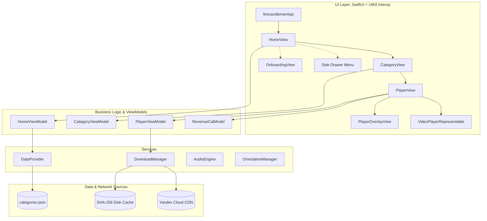

<div align="center">

# 🔥 Fireplace & Candle Light: Ambient 4K Screensaver

### Free Open-Source iOS Starter Project by Vibecode Mobile App Academy

[](https://swift.org)
[](https://developer.apple.com/ios/)
[](https://developer.apple.com/xcode/swiftui/)
[](https://www.revenuecat.com/)
[](https://dimvibecode.vercel.app)
[](https://dimvibecode.vercel.app)

<br/>

> 🎓 **Free Open-Source Project by Vibecode Mobile App Academy**  
> This production codebase is provided free to kickstart your journey. However, cloning is only step zero — in our Academy, you learn how to turn this foundation into a **100% unique commercial application with proprietary features, smooth App Store approval, and direct curator mentorship**:  
> 👉 **[Visit Vibecode Mobile App Academy](https://dimvibecode.vercel.app)** — Master mobile vibe coding, pass App Store review on the first try, and ship profitable apps.

</div>

---

## 📖 About This Free Starter Project

**firecandlemer** (*Fireplace & Candle Light: Ambient 4K Screensaver*) is a real-world, commercial-grade iOS application for iPhone and iPad in the **Health & Fitness / Utilities / Relaxation** category.

It transforms the device into an ambient nightlight, virtual fireplace, or meditation backdrop featuring seamlessly looping high-definition/4K video scenes paired with immersive realistic sound:
- 🪵 **Crackling Fireplaces** (12 scenes)
- 🕯 **Warm Candlelight** (8 scenes)
- 🌧 **Rain & Thunderstorms** (10 scenes)
- 🐠 **Relaxing Aquariums** (8 scenes)
- 🦉 **Nature & Night Ambience** (8 scenes)
- 📻 **White Noise for Deep Focus & Sleep** (8 scenes)

This repository serves as a **production-ready educational foundation** demonstrating how to design a modern iOS app with paid subscriptions, offline media caching, hardware video looping, and marketing attribution.

> 🎬 **Video & Audio Files — Not Included in This Repository**  
> The 54 video scenes and audio tracks referenced by this codebase are **not part of the free open-source release**. These media assets are exclusively available to enrolled students of **[Vibecode Mobile App Academy](https://dimvibecode.vercel.app)**.  
> Academy students also receive **step-by-step instructions on how to generate and prepare their own unique video and audio assets** using AI generation tools — ensuring every published app has 100% original, royalty-free content.

---

## 🚀 Vibecode Mobile App Academy — The Learning Advantage

While this repository provides a fully functional open-source base, **simply publishing copied templates to the App Store does not work**. Apple strictly rejects duplicate templates under **Guideline 4.3 (Spam / Design Copycats)**. 

At **[Vibecode Mobile App Academy](https://dimvibecode.vercel.app)**, we teach you how to engineer and publish high-quality, commercially successful mobile applications with three decisive advantages:

> ### 🎓 Key Learning Advantages of Vibecode Academy:
>
> 1. **🧬 100% Unique Code Structure & Content**:  
>    Master prompt orchestration and AI coding workflows to build completely unique architectures, data schemas, and UI layouts that easily pass automated Apple code similarity scanners.
> 2. **🛡️ Unique Feature Engineering for Smooth App Store Review**:  
>    Design and integrate proprietary differentiator features (custom sound mixers, breathing exercises, interactive widgets, smart sleep timers) satisfying Apple Review Guidelines (4.2 & 4.3) and delivering real user value.
> 3. **👨‍🏫 Dedicated Curator & Mentor Support**:  
>    Get direct access to experienced mobile curators who answer questions, troubleshoot technical blockers, conduct pre-launch code reviews, and guide you through App Store approval.
> 4. **⚡ 10x Mobile Vibe Coding Velocity**:  
>    Ship native iOS & Android applications from concept to App Store launch in days, not months.

### 1. 🧬 Unique Code Structure & Content Generation
- **No cookie-cutter cloning**: You master how to direct AI coding agents to refactor, restructure, and generate a **truly unique architectural codebase and content catalog**.
- **Distinct binary footprint**: Custom data models, decoupled service boundaries, original UI design systems, and bespoke asset pipelines ensure that your application's Abstract Syntax Tree (AST) and structure are completely unique in the eyes of App Store automated checks.

### 2. 🛡️ Unique Feature Engineering for Seamless App Store Review
- **Passing moderation with confidence**: Apple requires apps to provide distinct utility and memorable user experiences.
- **Bespoke differentiator features**: In the Academy, students learn to design and implement unique, proprietary features that elevate simple utility apps into high-value products:
  - Custom ambient sound synthesizers & multi-track audio layering.
  - Interactive smart sleep timers, breathwork relaxation modes, and haptic feedback.
  - Native iOS Lock Screen & Home Screen Widgets, Siri Shortcuts, and Live Activities.
- These unique features ensure your app effortlessly satisfies Apple Review Guidelines (avoiding 4.3 Spam and 4.2 Minimum Functionality rejections) and gets approved swiftly.

### 3. 👨‍🏫 Personal Curator & Mentor Support
- **Never get stuck**: Developing apps and dealing with Apple's ecosystem can be challenging. Students in the Academy have direct access to an **experienced curator and mentor** who:
  - Answers all your technical questions and helps troubleshoot development blockers.
  - Reviews your code, project structure, and architecture before submission.
  - Guides you through Apple Developer accounts, certificates, RevenueCat setup, AppsFlyer, and OneSignal.
  - Assists with App Store Connect metadata, App Review guidelines, and crafting responses to reviewer queries.

### 4. ⚡ High-Velocity Mobile Vibe Coding
- Learn modern agentic engineering workflows: write concise architectural specifications, direct AI tools to generate bulletproof Swift/SwiftUI code, and ship polished iOS & Android apps in days instead of months.

---

## 🎯 What You Will Learn From This Project

By studying this codebase, students of [Vibecode Academy](https://dimvibecode.vercel.app) master essential production skills:

1. **Commercial MVVM + Service Layer Architecture**:
   - Clean separation of concerns between Views, ViewModels, and decoupled singleton services (`DownloadManager`, `DataProvider`, `AudioEngine`, `OrientationManager`).
2. **Advanced AVFoundation (Zero-Gap Hardware Video Looping)**:
   - Leveraging `AVQueuePlayer` + `AVPlayerLooper` to achieve infinite video loops with zero stutter, black frames, or lag.
   - Buffer latency optimization (`preferredForwardBufferDuration = 0`).
   - Configuring `AVAudioSession` with `.playback` category and `.mixWithOthers` option for uninterrupted audio.
3. **Monetization & In-App Purchases (RevenueCat + StoreKit)**:
   - In-app subscriptions integrated with **RevenueCat** and native **RevenueCatUI** (`PaywallView`).
   - Entitlement validation (`entitlements["premium"]`), purchase workflows, and purchase restoration.
   - Production freemium funnel: instant access to free scenes and automated paywall triggers for locked premium scenes.
4. **Offline-First Media Caching & Streaming Downloads**:
   - Custom network downloader based on `URLSessionDownloadDelegate`.
   - Cryptographic file hashing using **SHA-256** via Apple's **CryptoKit** framework.
   - Real-time progress updates (`0...100%`) and persistent storage in `FileManager.cachesDirectory`.
5. **Modern SwiftUI + Glassmorphism Interface**:
   - Dynamic category cards with live looping video previews.
   - 6-screen interactive video-based onboarding slider (`OnboardingView`).
   - Animated slide-out navigation drawer with spring physics.
6. **Smart Sleep Timer & Linear Audio Fadeout**:
   - Adjustable timer interval from 5 to 240 minutes.
   - Smooth linear volume fadeout algorithm from 100% down to 0% over the final 60 seconds before playback stops.
   - Automatic screen lock management via `UIApplication.shared.isIdleTimerDisabled`.
7. **Marketing Attribution & Push Notifications**:
   - Install and campaign attribution via **AppsFlyer**.
   - User engagement and push notifications via **OneSignal**.
   - Compliant **AppTrackingTransparency (ATT)** permission dialog requested asynchronously after launch.
8. **Internationalization with Apple String Catalogs**:
   - Fully localized in modern **String Catalogs (`Localizable.xcstrings`)** across 20+ languages worldwide.

---

## 🛠 Technology Stack

| Category | Technology / Framework |
| :--- | :--- |
| **Language** | Swift 5.9+ (Modern Concurrency: `async/await`, `Task`, `@MainActor`) |
| **UI Framework** | SwiftUI, UIKit Interop (`UIViewRepresentable`, `UIViewControllerRepresentable`) |
| **Media Engine** | AVFoundation (`AVQueuePlayer`, `AVPlayerLooper`, `AVAsset`, `AVAudioSession`, `AVAudioPlayer`) |
| **Monetization / IAP** | RevenueCat (`5.90.2`), RevenueCatUI (`5.90.2`) |
| **Analytics & Attribution** | AppsFlyerFramework (`6.17.0`), AppTrackingTransparency (ATT) |
| **Push Notifications** | OneSignalFramework (`5.2.14`) |
| **Networking & Storage** | URLSession (DownloadTask), CryptoKit (SHA-256), Yandex Cloud Object Storage CDN |
| **Dependency Manager** | CocoaPods |

---

## 🏗 Architecture Overview



---

## 📂 Project Structure

```text
firecandlemer/
├── Config/
│   └── AppConfig.swift             # Remote video CDN base URL
├── Data/
│   ├── categories.json             # Metadata for categories and all 54 scenes
│   └── cat_*_bg.mp4                # Bundled looping background video previews
├── Models/
│   ├── Category.swift              # Category model (id, title, preview, videos)
│   └── VideoItem.swift             # Scene item model (videoKey, previewImageName, isFree)
├── ViewModels/
│   ├── HomeViewModel.swift         # Category loading and state management
│   ├── CategoryViewModel.swift     # Category video list state
│   └── PlayerViewModel.swift       # Player lifecycle, downloading, volume, and sleep timer
├── Views/
│   ├── HomeView.swift              # Main feed with category cards and side drawer
│   ├── CategoryView.swift          # Video scene grid for a selected category
│   ├── Player/
│   │   ├── PlayerView.swift        # Fullscreen player with downloading state & HUD
│   │   ├── PlayerOverlayView.swift # Controls overlay (mute, back, sleep timer)
│   │   └── VideoPlayerRepresentable.swift # AVPlayerLayer integration in SwiftUI
│   └── Shared/
│       └── LoopingBackgroundVideoView.swift # Seamless background video view
├── Services/
│   ├── DownloadManager.swift       # Async CDN downloader with SHA-256 disk caching
│   ├── DataProvider.swift          # Local bundle JSON parser
│   ├── AudioEngine.swift           # Audio session configuration & playback
│   └── OrientationManager.swift    # Programmatic screen orientation control
├── PaidSub/
│   ├── RevenueCatModel.swift       # In-App purchases, customer info, and premium checks
│   ├── PaidView.swift              # Paywall triggers and external legal links
│   ├── OnboardingView.swift        # 6-step interactive onboarding with video backgrounds
│   └── NoAnimationFullScreenModifier.swift # Seamless full-screen presentation modifier
├── Theme/
│   └── Theme.swift                 # Centralized design system: colors, fonts, spacing, radii
├── Assets.xcassets/                # Visual assets, scene thumbnails, app icon
├── Localizable.xcstrings           # Modern String Catalog with 20+ languages
├── firecandlemer.entitlements      # Push Notification entitlements
└── firecandlemerApp.swift          # Application entry point & SDK initialization
```

---

## 🔑 Keys, Identifiers & Configuration Guide

Before releasing the application under your own Apple Developer account, replace all placeholder keys and IDs with your own credentials. Below is a comprehensive reference map detailing **every key, identifier, its file location, and line number**:

### 🗺 Quick Reference Table

| Parameter / Key | File | Line(s) | Placeholder / Variable | Description |
| :--- | :--- | :---: | :--- | :--- |
| **RevenueCat API Key** | `firecandlemer/firecandlemerApp.swift` | 25 | `"YOUR_REVENUECAT_API_KEY"` | Public SDK Key from RevenueCat |
| **AppsFlyer Dev Key** | `firecandlemer/firecandlemerApp.swift` | 27 | `"YOUR_APPSFLYER_DEV_KEY"` | AppsFlyer SDK Dev Key |
| **Apple App ID (AppsFlyer)** | `firecandlemer/firecandlemerApp.swift` | 28 | `"YOUR_APPLE_APP_ID"` | Numeric App ID from App Store Connect |
| **OneSignal App ID** | `firecandlemer/firecandlemerApp.swift` | 31 | `"YOUR_ONESIGNAL_APP_ID"` | OneSignal Application UUID |
| **Production Paywall Mode** | `firecandlemer/PaidSub/PaidView.swift` | 11 | `isPremiumPROD` | `false` for testing, `true` for App Store release |
| **App Store URL** | `firecandlemer/PaidSub/PaidView.swift` | 13 | `"https://apps.apple.com/app/idYOUR_APPLE_APP_ID"` | Store link for "Rate App" & "Share App" |
| **Privacy Policy URL** | `firecandlemer/PaidSub/PaidView.swift` | 14 | `"https://yourdomain.com/privacy"` | Privacy policy link in the side menu |
| **Terms of Use URL** | `firecandlemer/PaidSub/PaidView.swift` | 15 | `"https://yourdomain.com/terms"` | Terms of use (EULA) link in the side menu |
| **CDN Base URL** | `firecandlemer/Config/AppConfig.swift` | 6 | `"https://YOUR_STORAGE_URL_OR_CDN_BASE_PATH/"` | Root URL of cloud storage hosting video files |
| **Bundle Identifier** | `firecandlemer.xcodeproj` | Project settings | `PRODUCT_BUNDLE_IDENTIFIER` | Your unique app ID (e.g. `com.yourcompany.app`) |

---

### 📝 Detailed Configuration Instructions

#### 1. RevenueCat Configuration (In-App Purchases)
- **File**: [`firecandlemer/firecandlemerApp.swift`](file:///Users/dmitriybychikhin/APPS/XCODE/Fireplace/firecandlemer/firecandlemer/firecandlemerApp.swift#L24-L26)
- **Code snippet**:
  ```swift
  Purchases.logLevel = .debug
  Purchases.configure(withAPIKey: "YOUR_REVENUECAT_API_KEY")
  ```
- **How to obtain**:
  1. Go to [RevenueCat Dashboard](https://app.revenuecat.com/).
  2. Select your Project → **Project Settings** → **API Keys**.
  3. Copy the **Public App-Specific API Key** for iOS (starts with `appl_`).
  4. Ensure your entitlement in RevenueCat is named **`premium`** (used in `RevenueCatModel.swift`).

#### 2. AppsFlyer Configuration (Attribution & Marketing Analytics)
- **File**: [`firecandlemer/firecandlemerApp.swift`](file:///Users/dmitriybychikhin/APPS/XCODE/Fireplace/firecandlemer/firecandlemer/firecandlemerApp.swift#L27-L29)
- **Code snippet**:
  ```swift
  AppsFlyerLib.shared().appsFlyerDevKey = "YOUR_APPSFLYER_DEV_KEY"
  AppsFlyerLib.shared().appleAppID = "YOUR_APPLE_APP_ID"
  AppsFlyerLib.shared().start()
  ```
- **How to obtain**:
  1. Open [AppsFlyer Dashboard](https://hq1.appsflyer.com/) → **App Settings**.
  2. Copy your **Dev Key**.
  3. In [App Store Connect](https://appstoreconnect.apple.com/), create your app and copy the 10-digit **Apple ID** from **App Information** (e.g., `6752294033`).

#### 3. OneSignal Configuration (Push Notifications)
- **File**: [`firecandlemer/firecandlemerApp.swift`](file:///Users/dmitriybychikhin/APPS/XCODE/Fireplace/firecandlemer/firecandlemer/firecandlemerApp.swift#L31-L37)
- **Code snippet**:
  ```swift
  OneSignal.initialize("YOUR_ONESIGNAL_APP_ID")
  ```
- **How to obtain**:
  1. Open [OneSignal Dashboard](https://onesignal.com/) → Your App → **Settings** → **Keys & IDs**.
  2. Copy the **OneSignal App ID** (UUID format: `xxxxxxxx-xxxx-xxxx-xxxx-xxxxxxxxxxxx`).
  3. Upload your Apple Push Notification Service (APNs) `.p8` key in OneSignal Settings.

#### 4. App Links, Legal Documents & Testing Mode
- **File**: [`firecandlemer/PaidSub/PaidView.swift`](file:///Users/dmitriybychikhin/APPS/XCODE/Fireplace/firecandlemer/firecandlemer/PaidSub/PaidView.swift#L9-L17)
- **Code snippet**:
  ```swift
  struct Setting {
      // Set to true for Production App Store release, false for local testing
      static let isPremiumPROD = false

      static let appLink = "https://apps.apple.com/app/idYOUR_APPLE_APP_ID"
      static let privacyLink = "https://yourdomain.com/privacy"
      static let termsLink = "https://yourdomain.com/terms"
  }
  ```
- **Instructions**:
  - `isPremiumPROD`: Keep `false` during local development and testing so all 54 scenes are unlocked. Change to `true` when submitting to Apple App Review so the paywall is enforced.
  - Replace `appLink`, `privacyLink`, and `termsLink` with your actual website pages and App Store link.

#### 5. Remote Video CDN Base URL & Video Catalog (`categories.json`)
- **File**: [`firecandlemer/Config/AppConfig.swift`](file:///Users/dmitriybychikhin/APPS/XCODE/Fireplace/firecandlemer/firecandlemer/Config/AppConfig.swift#L3-L7)
- **Code snippet**:
  ```swift
  enum AppConfig {
      // Base CDN URL; final URL = cdnBase + videoKey + ".mp4"
      // Replace with your external cloud storage root URL ending with a trailing slash "/"
      static let cdnBase: String = "https://YOUR_STORAGE_URL_OR_CDN_BASE_PATH/"
  }
  ```
- **How URL Resolution Works**:
  The application streams and downloads videos on demand. In `VideoItem.swift`, each video's download URL is constructed as:
  ```swift
  let path = AppConfig.cdnBase + videoKey + ".mp4"
  ```
  > ⚠️ **Important**: Ensure your `cdnBase` string ends with a trailing slash `/` (e.g. `https://my-bucket.s3.amazonaws.com/videos/` or `https://cdn.example.com/fireplace/`).

- **Video Files Mapping with [`categories.json`](file:///Users/dmitriybychikhin/APPS/XCODE/Fireplace/firecandlemer/firecandlemer/Data/categories.json)**:
  All video scenes configured in `categories.json` must be uploaded to your external cloud storage directly under the path specified in `cdnBase`. The file names must match the `videoURL` key plus the `.mp4` extension:

  | Category | Expected Video Files on Your External Storage | Total Files |
  | :--- | :--- | :---: |
  | **Fireplace** | `hd_fire1.mp4` … `hd_fire12.mp4` | 12 |
  | **Candle** | `hd_candle1.mp4` … `hd_candle8.mp4` | 8 |
  | **Rain** | `hd_rain1.mp4` … `hd_rain10.mp4` | 10 |
  | **Aquarium** | `hd_aqua1.mp4` … `hd_aqua8.mp4` | 8 |
  | **Nature** | `hd_nature1.mp4` … `hd_nature8.mp4` | 8 |
  | **White Noise** | `hd_noise1.mp4` … `hd_noise8.mp4` | 8 |
  | **Total** | | **54 files** |

  *Supported cloud providers: Any public HTTP/HTTPS endpoint or S3-compatible bucket (Cloudflare R2, AWS S3, DigitalOcean Spaces, BunnyCDN, Yandex Cloud, Google Cloud Storage, Supabase Storage).*

> 🎬 **Video & Audio Files — Academy Students Only**
>
> **The actual `.mp4` video and audio files are not included in this free repository.**
>
> Enrolled students of **[Vibecode Mobile App Academy](https://dimvibecode.vercel.app)** receive:
> - ✅ Access to the full library of 54 ready-to-use HD video scenes and ambient audio tracks.
> - ✅ A detailed **step-by-step guide on generating your own unique video and audio content** using AI generation tools (Sora, Runway, ElevenLabs, and others) — so your published app contains 100% original, royalty-free media that is completely unique to you.
>
> 👉 **[Join Vibecode Mobile App Academy](https://dimvibecode.vercel.app)** to get full media access and the asset generation guide.

#### 6. Bundle Identifier & Code Signing
- **Location**: Xcode Project Navigator → Click root project `firecandlemer` → Target `firecandlemer` → **Signing & Capabilities**.
- **Instructions**:
  - Change **Bundle Identifier** (default: `com.vibecode.firecandlemer`) to your own unique identifier (e.g. `com.yourcompany.fireplace`).
  - Select your Apple Developer **Team** to enable automatic code signing and provisioning profiles.

---

## 🚀 Quick Start Guide for Students

### 1. Prerequisites:
- macOS Sonoma or Sequoia
- Xcode 15.0 or newer
- [CocoaPods](https://cocoapods.org) installed (`sudo gem install cocoapods` or `brew install cocoapods`)

### 2. Setup and Execution:
1. Clone the repository:
   ```bash
   git clone <REPOSITORY_URL>
   cd firecandlemer
   ```
2. Install CocoaPods dependencies:
   ```bash
   pod install
   ```
3. Open the generated Xcode workspace (do **not** open `.xcodeproj` directly):
   ```bash
   open firecandlemer.xcworkspace
   ```
4. **Local Student Test Mode**:
   - By default, `firecandlemer/PaidSub/PaidView.swift` has `isPremiumPROD = false`.
   - In this mode, **all 54 scenes are unlocked immediately** so you can test video streaming, downloading, and playback without configuring RevenueCat or StoreKit.
5. Select any iPhone 15/16 Simulator or a physical device and press **Run** (`Cmd + R`).

---

## 💡 Ready to Build and Launch Your Own Apps?

Transform this free starter project into your own profitable app business with **[Vibecode Mobile App Academy](https://dimvibecode.vercel.app)**:

- 🧬 **100% Unique Codebase & Architecture**: Build distinct, original apps with AI vibe coding that avoid Guideline 4.3 clone flags.
- 🛡️ **Smooth App Store Review Process**: Engineer unique differentiator features that satisfy Apple review guidelines on the first submission.
- 👨‍🏫 **Personal Curator & Mentor Support**: Direct access to expert mobile engineers who review your code and resolve any development or submission blockers.
- 💰 **Production Monetization**: Master in-app purchases and subscriptions with RevenueCat and StoreKit 2.
- 🚀 **10x Velocity**: Go from initial idea to live App Store release in days, not months.

👉 **Official Academy Website**: [https://dimvibecode.vercel.app](https://dimvibecode.vercel.app)

---

## 📄 License

This source code is distributed for educational purposes for students of **Vibecode Academy**. You are free to study, modify, and apply these architectural patterns in your own mobile applications.
